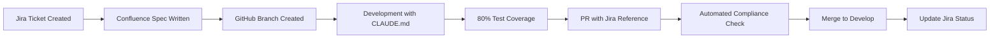

# 🎯 AI_AGE_SDLC Complete Setup Guide

## 📚 Table of Contents
1. [Overview](#overview)
2. [Jira Setup](#jira-setup)
3. [Confluence Setup](#confluence-setup)
4. [GitHub Setup](#github-setup)
5. [Integration Workflow](#integration-workflow)
6. [Automated Setup Scripts](#automated-setup-scripts)

---

## 🔍 Overview

The AI_AGE_SDLC requires three core services to be properly configured:
- **Jira**: Task/story management and tracking
- **Confluence**: Technical specifications and documentation
- **GitHub**: Code repository and version control

## 1️⃣ Jira Setup

### Step 1: Create Jira Account & Project

1. **Sign up for Atlassian**:
   - Go to https://www.atlassian.com/software/jira
   - Create free account (up to 10 users)
   - Choose "Jira Software" for development projects

2. **Create a Project**:
   ```
   Projects → Create Project → Scrum (recommended)
   Project Name: "AI Age SDLC Development"
   Project Key: "AISD" (or your choice)
   ```

3. **Configure Project Settings**:
   ```
   Project Settings → Issue Types
   ✅ Story
   ✅ Task  
   ✅ Bug
   ✅ Epic
   ```

### Step 2: Generate API Token

1. Go to https://id.atlassian.com/manage-profile/security/api-tokens
2. Click "Create API token"
3. Label: "AI_AGE_SDLC Integration"
4. Copy token immediately (shown only once!)

### Step 3: Create Jira Workflow

```yaml
Workflow States:
  - TO DO: Initial state
  - IN PROGRESS: Development active
  - IN REVIEW: Code review
  - TESTING: QA/Testing phase
  - DONE: Completed

Transitions:
  - Start Progress: TO DO → IN PROGRESS
  - Submit Review: IN PROGRESS → IN REVIEW  
  - Begin Testing: IN REVIEW → TESTING
  - Complete: TESTING → DONE
```

### Step 4: Create Issue Template

Create a Jira issue template for consistency:

```markdown
## Story/Task Template

### Description
[Brief description of the feature/task]

### Acceptance Criteria
- [ ] Criterion 1
- [ ] Criterion 2
- [ ] Criterion 3

### Technical Requirements
- Database changes: [Yes/No]
- API changes: [Yes/No]
- UI changes: [Yes/No]

### Confluence Spec
Link: [Confluence Page URL]

### Test Coverage Target
Minimum: 80%

### Definition of Done
- [ ] Code complete
- [ ] Unit tests written (80% coverage)
- [ ] Integration tests passed
- [ ] Code reviewed
- [ ] Documentation updated
```

### Step 5: Automation Rules

Create these Jira automation rules:

```yaml
Rule 1: Link Confluence on Creation
  When: Issue created
  Then: Add comment "Please link Confluence specification"
  
Rule 2: Validate Before In Progress
  When: Status changes to "In Progress"
  If: Confluence link is empty
  Then: Transition back to "TO DO" with comment

Rule 3: Auto-assign on Start
  When: Status changes to "In Progress"
  Then: Assign to current user
```

---

## 2️⃣ Confluence Setup

### Step 1: Create Confluence Space

1. **Access Confluence**:
   - Same Atlassian account as Jira
   - Go to https://[your-domain].atlassian.net/wiki

2. **Create Space**:
   ```
   Spaces → Create Space → Blank Space
   Space Name: "AI Age SDLC Specifications"
   Space Key: "AISPEC"
   ```

### Step 2: Create Page Templates

#### Technical Specification Template

Create this as a Confluence template:

```markdown
# [FEATURE NAME] Technical Specification

## 1. Overview
**Jira Ticket**: [AISD-XXX]
**Author**: [Name]
**Date**: [Date]
**Status**: [Draft/Approved/In Development]

## 2. Business Requirements
### Problem Statement
[What problem are we solving?]

### Success Criteria
- [ ] Measurable outcome 1
- [ ] Measurable outcome 2

## 3. Technical Design
### Architecture
[Diagrams, flow charts]

### API Specification
```yaml
Endpoint: POST /api/v1/feature
Request:
  {
    "field1": "string",
    "field2": "number"
  }
Response:
  {
    "status": "success",
    "data": {}
  }
```

### Database Schema
```sql
CREATE TABLE feature_table (
  id SERIAL PRIMARY KEY,
  field1 VARCHAR(255),
  created_at TIMESTAMP
);
```

## 4. Implementation Plan
### Phase 1: [Description]
- Task 1
- Task 2

### Phase 2: [Description]
- Task 3
- Task 4

## 5. Testing Strategy
### Unit Tests
- Test scenario 1
- Test scenario 2

### Integration Tests
- API endpoint testing
- Database transaction testing

### Performance Requirements
- Response time: < 200ms
- Concurrent users: 100+
- Success rate: > 99.9%

## 6. Security Considerations
- Authentication: [Method]
- Authorization: [Roles/Permissions]
- Data encryption: [Yes/No]

## 7. Dependencies
- External service 1
- Library/Package 2

## 8. Rollback Plan
[How to rollback if issues occur]

## 9. Documentation
- [ ] API documentation
- [ ] User guide
- [ ] Developer notes
```

### Step 3: Link Confluence to Jira

1. **Enable Smart Links**:
   ```
   Confluence Settings → Integrations → Jira
   Enable: Smart Links
   ```

2. **Create Automation**:
   ```
   When: Page created with Jira key in title
   Then: Auto-link to Jira issue
   ```

---

## 3️⃣ GitHub Setup

### Step 1: Create Repository

```bash
# Using GitHub CLI
gh repo create ai-age-sdlc-project \
  --public \
  --description "AI Age SDLC Managed Project" \
  --clone

# Or using API
curl -X POST -H "Authorization: token $GITHUB_TOKEN" \
  https://api.github.com/user/repos \
  -d '{"name":"ai-age-sdlc-project","description":"AI Age SDLC Managed Project"}'
```

### Step 2: Configure Branches

```bash
# Create development branches
git checkout -b develop
git push -u origin develop

git checkout -b release
git push -u origin release

# Set branch protection rules
gh api repos/:owner/:repo/branches/main/protection \
  --method PUT \
  --field required_status_checks='{"strict":true,"contexts":["continuous-integration"]}' \
  --field enforce_admins=false \
  --field required_pull_request_reviews='{"dismiss_stale_reviews":true,"require_code_owner_reviews":true}'
```

### Step 3: Create GitHub Labels

```bash
# Create SDLC-specific labels
gh label create "jira-linked" --description "Has Jira ticket" --color 0E8A16
gh label create "confluence-spec" --description "Has Confluence spec" --color 1D76DB
gh label create "80-coverage" --description "Meets 80% test coverage" --color 5319E7
gh label create "sdlc-compliant" --description "Meets all SDLC requirements" --color 28A745
```

### Step 4: GitHub Actions Workflow

Create `.github/workflows/sdlc-compliance.yml`:

```yaml
name: AI Age SDLC Compliance Check

on:
  pull_request:
    types: [opened, edited, synchronize]

jobs:
  sdlc-compliance:
    runs-on: ubuntu-latest
    steps:
      - uses: actions/checkout@v3
      
      - name: Check Jira Reference
        run: |
          if ! grep -E '\[AISD-[0-9]+\]' <<< "${{ github.event.pull_request.title }}"; then
            echo "❌ No Jira ticket reference in PR title"
            exit 1
          fi
          
      - name: Validate Test Coverage
        run: |
          # Run your test coverage command
          npm test -- --coverage
          COVERAGE=$(cat coverage/coverage-summary.json | jq '.total.lines.pct')
          if (( $(echo "$COVERAGE < 80" | bc -l) )); then
            echo "❌ Test coverage ${COVERAGE}% is below 80%"
            exit 1
          fi
          
      - name: Check Confluence Link
        run: |
          if ! grep -E 'confluence.*atlassian.*wiki' <<< "${{ github.event.pull_request.body }}"; then
            echo "⚠️ No Confluence link found in PR description"
          fi
```

### Step 5: Branch Strategy

```
main (production)
  ↑
release (staging)
  ↑
develop (integration)
  ↑
feature/AISD-XXX (feature branches)
```

---

## 4️⃣ Integration Workflow

### Complete Development Flow



### Naming Conventions

```yaml
Jira Tickets: [PROJECT]-[NUMBER]
  Example: AISD-101

Confluence Pages: [TICKET] - [Feature Name]
  Example: AISD-101 - User Authentication

GitHub Branches: feature/[TICKET]-[description]
  Example: feature/AISD-101-user-auth

Commits: [TICKET] Brief description
  Example: [AISD-101] Add login endpoint

Pull Requests: [TICKET] Feature Name
  Example: [AISD-101] User Authentication Implementation
```

---

## 5️⃣ Automated Setup Scripts

### Quick Setup Script

Save as `setup_sdlc_services.sh`:

```bash
#!/bin/bash

echo "🚀 AI_AGE_SDLC Service Setup Wizard"
echo "===================================="

# Collect Information
read -p "Enter Jira Domain (e.g., mycompany): " JIRA_DOMAIN
read -p "Enter Jira Project Key (e.g., AISD): " PROJECT_KEY
read -p "Enter GitHub Organization: " GITHUB_ORG
read -p "Enter GitHub Repository Name: " REPO_NAME

# Jira Setup
echo "📋 Setting up Jira..."
curl -X POST \
  -H "Authorization: Bearer $JIRA_API_TOKEN" \
  -H "Content-Type: application/json" \
  "https://${JIRA_DOMAIN}.atlassian.net/rest/api/3/project" \
  -d '{
    "key": "'$PROJECT_KEY'",
    "name": "AI Age SDLC Project",
    "projectTypeKey": "software",
    "leadAccountId": "'$JIRA_ACCOUNT_ID'"
  }'

# Confluence Setup
echo "📚 Setting up Confluence..."
curl -X POST \
  -H "Authorization: Bearer $CONFLUENCE_API_TOKEN" \
  -H "Content-Type: application/json" \
  "https://${JIRA_DOMAIN}.atlassian.net/wiki/rest/api/space" \
  -d '{
    "key": "'$PROJECT_KEY'SPEC",
    "name": "'$PROJECT_KEY' Specifications"
  }'

# GitHub Setup
echo "🐙 Setting up GitHub..."
gh repo create "${GITHUB_ORG}/${REPO_NAME}" \
  --public \
  --description "AI Age SDLC Managed Project"

# Create .env file
cat > .env << EOF
# AI_AGE_SDLC Configuration
JIRA_URL=https://${JIRA_DOMAIN}.atlassian.net
JIRA_PROJECT_KEY=${PROJECT_KEY}
JIRA_EMAIL=${JIRA_EMAIL}
JIRA_API_TOKEN=${JIRA_API_TOKEN}

CONFLUENCE_URL=https://${JIRA_DOMAIN}.atlassian.net/wiki
CONFLUENCE_SPACE_KEY=${PROJECT_KEY}SPEC
CONFLUENCE_EMAIL=${CONFLUENCE_EMAIL}
CONFLUENCE_API_TOKEN=${CONFLUENCE_API_TOKEN}

GITHUB_OWNER=${GITHUB_ORG}
GITHUB_REPO=${REPO_NAME}
GITHUB_TOKEN=${GITHUB_TOKEN}
EOF

echo "✅ Setup complete! Services configured."
```

### Validation Script

Save as `validate_sdlc_setup.sh`:

```bash
#!/bin/bash

source .env

echo "🔍 Validating AI_AGE_SDLC Setup..."

# Test Jira
echo -n "Testing Jira connection... "
JIRA_STATUS=$(curl -s -o /dev/null -w "%{http_code}" \
  -u "${JIRA_EMAIL}:${JIRA_API_TOKEN}" \
  "${JIRA_URL}/rest/api/2/myself")
  
if [ "$JIRA_STATUS" = "200" ]; then
  echo "✅ Connected"
else
  echo "❌ Failed (HTTP $JIRA_STATUS)"
fi

# Test Confluence
echo -n "Testing Confluence connection... "
CONF_STATUS=$(curl -s -o /dev/null -w "%{http_code}" \
  -u "${CONFLUENCE_EMAIL}:${CONFLUENCE_API_TOKEN}" \
  "${CONFLUENCE_URL}/rest/api/content")
  
if [ "$CONF_STATUS" = "200" ]; then
  echo "✅ Connected"
else
  echo "❌ Failed (HTTP $CONF_STATUS)"
fi

# Test GitHub
echo -n "Testing GitHub connection... "
GH_STATUS=$(curl -s -o /dev/null -w "%{http_code}" \
  -H "Authorization: token ${GITHUB_TOKEN}" \
  "https://api.github.com/repos/${GITHUB_OWNER}/${GITHUB_REPO}")
  
if [ "$GH_STATUS" = "200" ]; then
  echo "✅ Connected"
else
  echo "❌ Failed (HTTP $GH_STATUS)"
fi

echo ""
echo "📊 Setup Status Summary:"
echo "========================"
[ "$JIRA_STATUS" = "200" ] && echo "✅ Jira: Ready" || echo "❌ Jira: Not configured"
[ "$CONF_STATUS" = "200" ] && echo "✅ Confluence: Ready" || echo "❌ Confluence: Not configured"
[ "$GH_STATUS" = "200" ] && echo "✅ GitHub: Ready" || echo "❌ GitHub: Not configured"
```

---

## 🎯 Quick Start Checklist

- [ ] Create Atlassian account
- [ ] Set up Jira project with workflow
- [ ] Generate Jira API token
- [ ] Create Confluence space with templates
- [ ] Set up GitHub repository with branches
- [ ] Generate GitHub personal access token
- [ ] Configure .env with all credentials
- [ ] Run validation script to confirm setup
- [ ] Create first Jira ticket
- [ ] Write Confluence specification
- [ ] Start development with CLAUDE.md

---

## 📚 Additional Resources

- [Jira API Documentation](https://developer.atlassian.com/cloud/jira/platform/rest/v3/)
- [Confluence API Documentation](https://developer.atlassian.com/cloud/confluence/rest/)
- [GitHub API Documentation](https://docs.github.com/en/rest)
- [AI_AGE_SDLC Framework Documentation](./CLAUDE.md)

---

*This guide ensures your entire development ecosystem is properly configured for the AI_AGE_SDLC framework.*